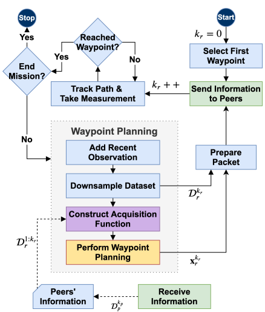
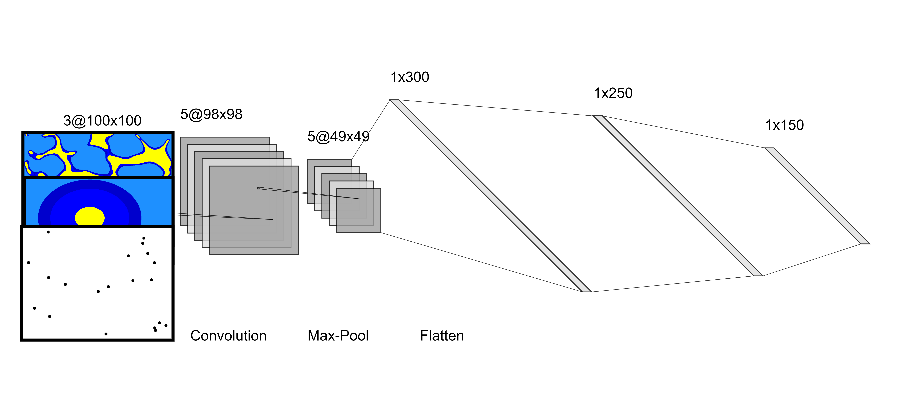
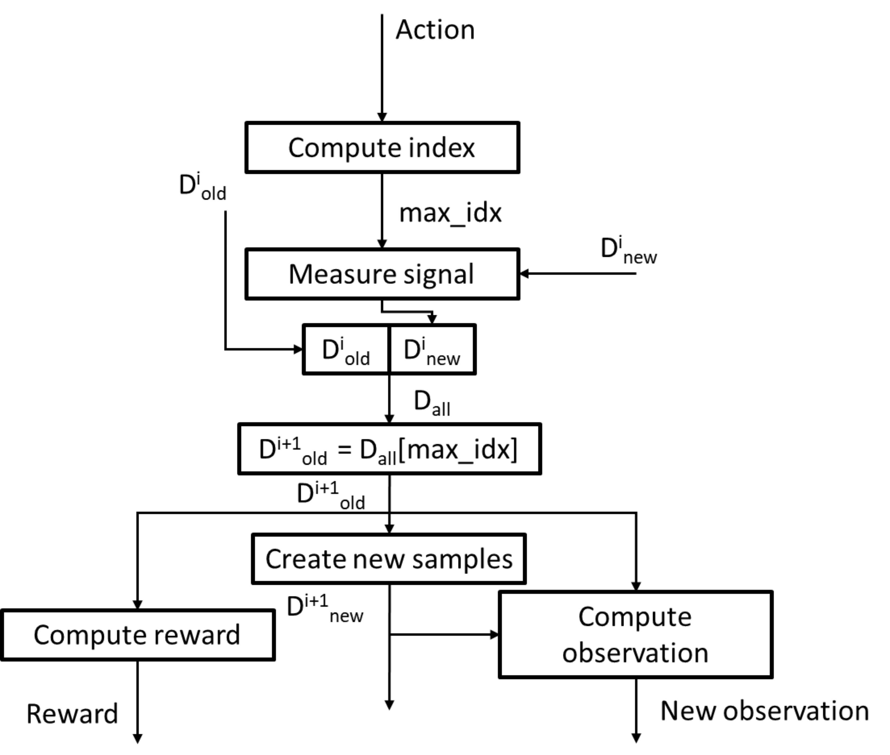

# CNN_Downsampler
A reinforcement learning agent which uses a CNN policy network to effectively downsample observations. 

This repo was made to compliment the original [Bayes-Swarm](http://adams.eng.buffalo.edu/wp-content/uploads/2016/02/Ghassemi_JCISE-19-1275.pdf) algorithm. The Bayes-Swarm repository I worked in is private, so I'm putting the contribution here since it is a separate environment. 

This is the flowchart for the original Bayes-Swarm algorithm:

In Bayes-Swarm a swarm of robots set out to localize a source signal. Each robot shares information with their neighbors, and this causes their observation set to increase exponentially with time. To combat this, the algorithm uses integer-downsampling, which loses information. 

Using a CNN policy network, a reinforcement learning agent is trained to **effectively** downsample information, which can help the swarm retain important information for waypoint planning, and finish the mission faster. Here is the CNN policy network which takes new observations, and guassian process (GP) outputs for the source signal environment:

The Bayes-Swarm algorithm uses a guassian process for each robot in the swarm, and particle swarm optimization to find new waypoints. This made training take much longer than it needed to, so a new environment was created to mitigate that. The flowchart for this environment is shown below, and what this repo is showcasing:

where D_old and D_new are the old and new observations respectively. This environment is centralized, and trains with one GP. Multiple robots can be simulated at once in the environment, and new observations are made following the scheme of the original Bayes-Swarm algorithm. Mutual information (MI) is used to formulate the reward via a threshold, which pushes the agent to generate some observation overlap when it filters data, but not too much to make the filtered data redundant.

The agent was trained for 2 million steps in this environment, and tested against a ransac MI downsampler and the integer factor downsampler from the original Bayes-Swarm algorithm. More will be posted here when the paper is finalized and published. 

